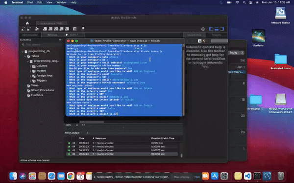

# Team-Profile-Generator


Week 10 - OOP assignment for the Trilogy/Southern Methodist University Web Development Bootcamp

## About
This project was created for Week 10 - OOP of the Trilogy/Southern Methodist University Web Development Bootcamp. It is a CLI application that uses user input to create profiles for members of a development team. The app then generates an html file displaying the team members in a default browser.

## Built With
* NodeJS
  * Inquirer
  * FS
  * Util

## Getting Started
   Step 1. Clone the repo
  ``` git clone https://github.com/ashleysalinas/Professional-README-Generator.git ```
  
  Step 2. CD into local copy folder 
  ``` cd Professional-README-Generator ```
  
  Step 3. Run the index file using Node in the CLI
  ``` node index.js ```
  
  Step 4. Follow the prompts provided in the CLI. Answer accordingly.
  
  Step 5. When finished, check the repository for the newly created README.md
  ``` ls ```
  ``` open README.md ```
    The above command should open a copy of the file in your default browser.
  
  
  ## Usage
 Use this project to create README files for your projects directly from your command line. The easy-to-use app automatically generates professional READMEs directly into your project's repository to explain your work to other users.
 
 ## License
 Distributed under the MIT Licencse.
