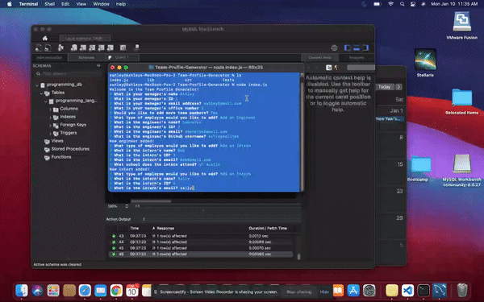

# Team-Profile-Generator



Week 10 - OOP assignment for the Trilogy/Southern Methodist University Web Development Bootcamp

## About
This project was created for Week 10 - OOP of the Trilogy/Southern Methodist University Web Development Bootcamp. It is a CLI application that uses user input to create profiles for members of a development team. The project also demonstrates Jest for JavaScript testing.

## Built With
* NodeJS
  * Inquirer
  * FS
* Jest Javascript Testing

## Getting Started
### Prerequisites
  This app makes use of npm. To install, please follow the directions <a href="https://docs.npmjs.com/about-npm"> here</a>.
  
### Local Usage
   Step 1. Clone the repo
  ``` git clone https://github.com/ashleysalinas/Team-Profile-Generator.git ```
  
  Step 2. CD into local copy folder 
  ``` cd Team-Profile-Generator ```
  
  Step 3. Run the index file using Node in the CLI
  ``` node index.js ```
  
  Step 4. Follow the prompts provided in the CLI. Answer accordingly.
  
  Step 5. When finished, check the repository for the newly created newPage.html
  ``` ls ```
  ``` open newPage.html ```
    The above command should open a copy of the file in your default browser.
 ### Test
   To run the tests make sure that you have Jest added to your npm (installation instructions can be found <a href="https://jest-bot.github.io/jest/docs/getting-started.html"> here</a>. Once Jest is installed, type: 
   ``` npm run test (name of file) ```
  
  ## Usage
 Use this project to create HTML pages containing links to your team's respective names, emails, office numbers, Githubs, and school locations.
 
 ## Acknowledgements
 While the CSS was written on my own, styling ideas were provided by the team at Trilogy Education Services.
 
 ## License
 Distributed under the MIT Licencse.
